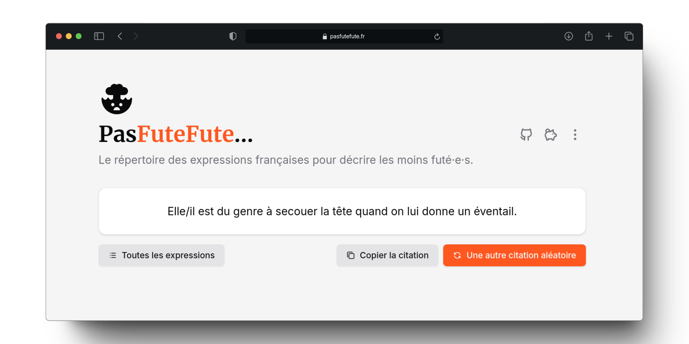

<p align="center">
<picture>
    <source srcset="./.github/icon-dark.png" media="(prefers-color-scheme: light)">
    <source srcset="./.github/icon-light.png" media="(prefers-color-scheme: dark)">
    
</picture>
</p>

<h1 align="center">
  Pas Fute Fute - Les expressions pour les moins futé·e·s
</h1>

<p align="center">
    Le répertoire des expressions françaises pour décrire les moins futé·e·s.
</p>

<p align="center">
  <a href="https://pasfutefute.fr">Website</a>
  <span>&nbsp;&nbsp;•&nbsp;&nbsp;</span>
  <a href="./packages/data/src/quotes.yaml">Les expressions</a>
</p>

## Introduction

**Pas Fute Fute...** est un répertoire des expressions françaises pour décrire les moins futé·e·s. Ce projet a pour but de recenser les expressions populaires françaises qui décrivent de manière humoristique et imagée les personnes, stupides, ou simplement maladroites.

[](https://pasfutefute.fr)

## Les features

- **Liste des expressions** : Découvrez les expressions populaires françaises pour décrire les moins futé·e·s.
- **Expression aléatoire** : Affiche une expression aléatoire.
- **Responsive** : Le site est responsive et s'adapte à tous les écrans.
- **Open source** : Le projet est open source et sous licence MIT.
- **Contributions** : Vous pouvez contribuer en ajoutant de nouvelles expressions.
- **API** : Une API est disponible pour récupérer les expressions.

## API

Une API est disponible pour récupérer les expressions.

Pour le moment, [une seule route](https://pasfutefute.fr/api/quotes/random) est disponible pour récupérer une expression aléatoire :

```bash
curl https://pasfutefute.fr/api/quotes/random

# {
#    "quote": "C'est pas le rosier le plus fleuri du jardin."
# }
```

## Contribuer

### Ajouter une expression

Pour ajouter une expression, il suffit de modifier le fichier [`quotes.yaml`](./packages/data/src/quotes.yaml) dans le dossier [`packages/data/src/`](./packages/data/src/).

A noter que pour être acceptée, une expression doit respecter les critères suivants :

- L'expression doit être en français
- L'expression doit être rédigée de façon inclusive
- Éviter les expressions vulgaires ou discriminatoires
- Pas de doublons ou de similarités forte avec des expressions déjà présentes

### Développement

Pour contribuer au développement du projet, vous pouvez cloner le dépôt et installer les dépendances avec `pnpm` :

```bash
git clone https://github.com/CorentinTh/pas-fute-fute.git
# ou
git clone git@github.com:CorentinTh/pas-fute-fute.git
# ou
gh repo clone CorentinTh/pas-fute-fute
```

Ensuite, installez les dépendances :

```bash
pnpm install
```

Pour lancer le projet en mode développement :

```bash
cd packages/app

pnpm dev
```

## License

Ce projet est open source et sous licence MIT. Rendez-vous sur le fichier [`LICENSE`](LICENSE) pour plus d'informations.

## Crédits

Ce projet est développé et maintenu avec passion par [Corentin Thomasset](https://corentin.tech).

Stack utilisée et mentions :

- Le site est développé avec [SolidStart](https://docs.solidjs.com/solid-start), un starter pour [SolidJS](https://docs.solidjs.com/).
- Le logo est l'icon [`face-explode-solid`](https://icones.js.org/collection/all?icon=flowbite:face-explode-solid) de la collection [flowbite](https://icones.js.org/collection/flowbite), sous licence MIT.
